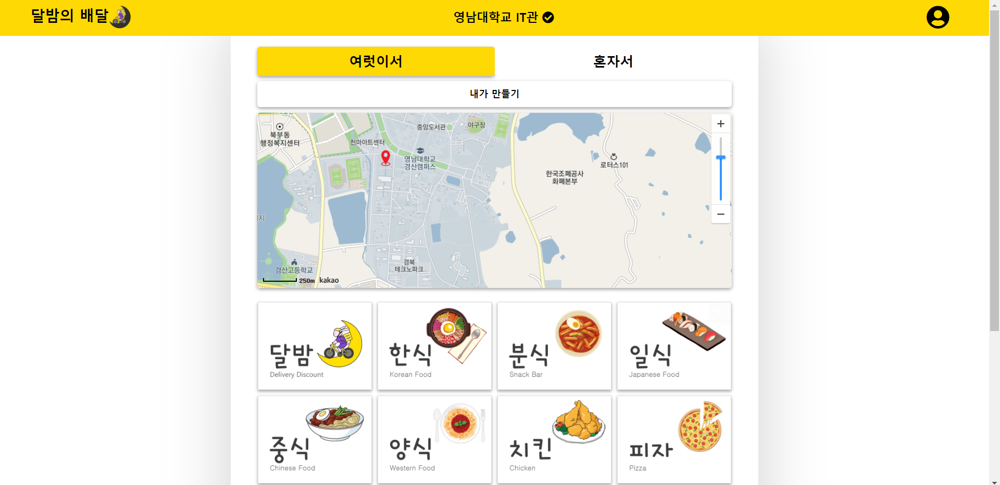
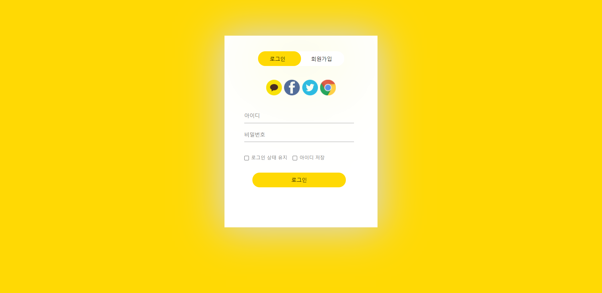
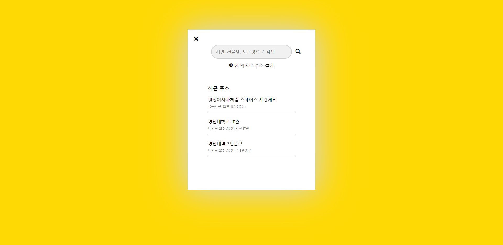
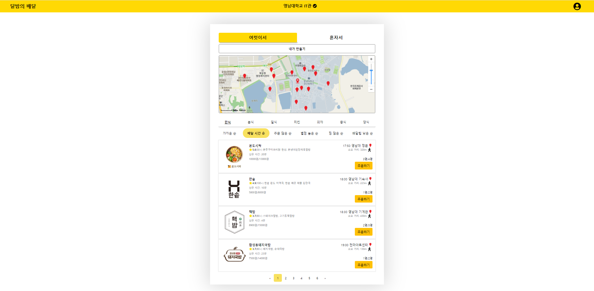
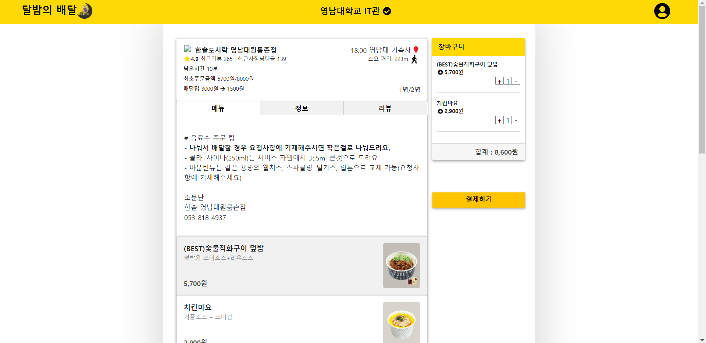
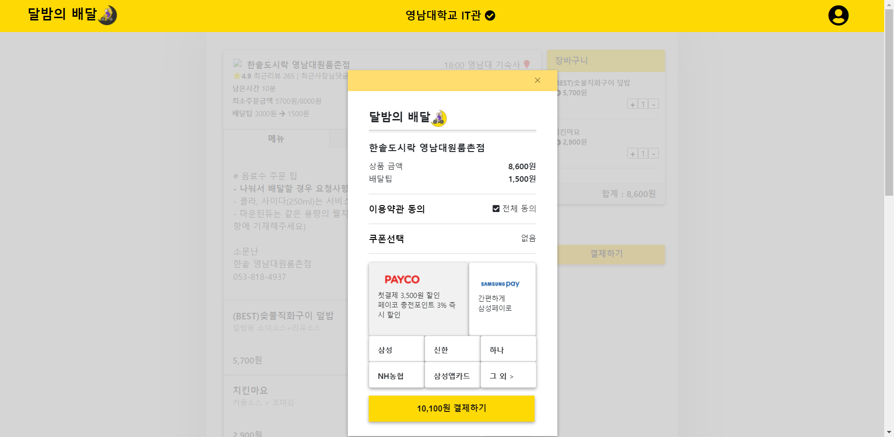
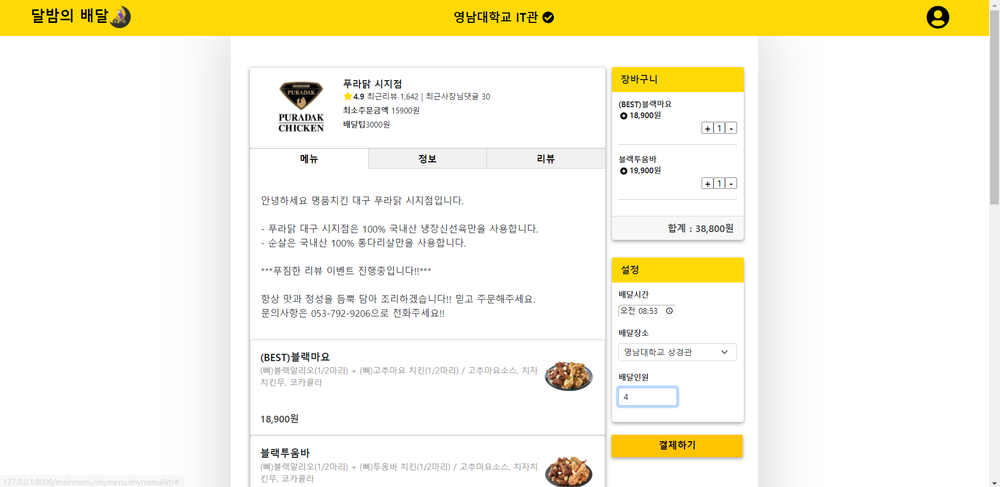
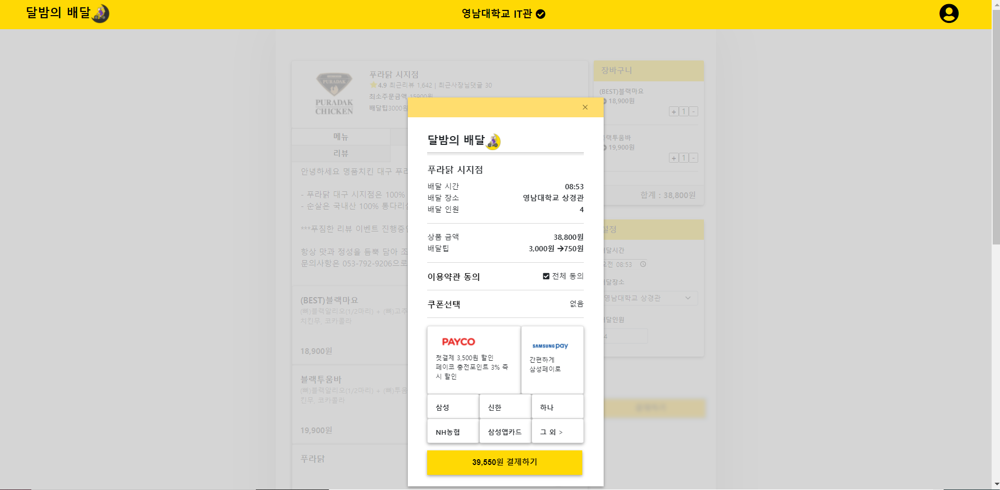

# :lion: LikeLion 9기 IdeaTon

### 달밤의배달
`1인가구를 위한 배달 서비스`로,  함께 배달 받기 때문에 최소주문금액을 쉽게 채울 수 있기 때문에 배달비를 절약할 수 있는 서비스
  
 

## Idea
#### :memo: 주 타깃층: 1인가구
- 1인가구가 증가함에 따라 배달수요가 1인가구 중심
#### :memo: 1인가구 배달 주문 시 문제점
- 배달비에 대한 부담감
- 1인가구가 채우기 힘든 최소주문금액
#### :bulb: 해결방법 
- 공동목적지를 설정하여 함께 배달 -> `개인 부담금 줄이기` `쉬운 최소주문금액 채우기`

## 역할
- `nawon-jo` : Design, Front-end, Leader.    
- `Dain-K`   : Design, Front-end.   
- `tanpo`    : Design modification, Git management, Front-end.   

## Demo 영상 
:movie_camera: [youtube 이동](https://www.youtube.com/watch?app=desktop&v=lQnrwgoIDS0&feature=youtu.be)

## results
### ⬇ 로그인 페이지

### ⬇ 위치설정 페이지  
 

### ⬇ 메인 페이지  

### ⬇ 메인 메뉴선택 페이지     

### ⬇ 메뉴선택 페이지    
 

### ⬇ 결제 페이지    
   

### ⬇ 내가 만들기 페이지  
   

### ⬇ 내가 만들기 결제 페이지
    

